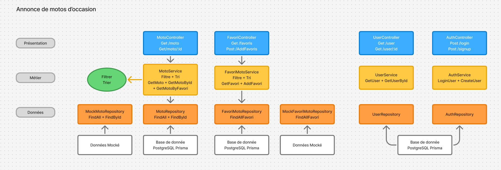

# MotoSearch

(frontend temporaire généré à l'IA pour s'amuser)

## Stack


Node.js 22 

TypeScript 5

Prisma 5

PostgreSQL 15

JWT + bcrypt


## Lancer l'API

###  mock

```bash
DATA_SOURCE=mock
```

### bdd prisma

```bash
docker compose up -d

npx prisma migrate dev --name init
npx prisma db seed

DATA_SOURCE=db
npm run dev
```


## Endpoints

#### Lister les motos

```
GET /api/motos
```


#### Détail d'une moto

```
GET /api/motos/:id
```


#### Créer un compte

```
POST /api/auth/register
Content-Type: application/json

{
  "email": "utilisateur@example.com",
  "password": "monmotdepasse"
}
```

retourne un token JWT

#### Se connecter

```
POST /api/auth/login
Content-Type: application/json

{
  "email": "utilisateur@example.com",
  "password": "monmotdepasse"
}
```


#### Lister ses favoris

```
GET /api/favoris
```


#### Ajouter un favori

```
POST /api/favoris/:motoId
```


#### Supprimer un favori

```
DELETE /api/favoris/:motoId
```
Tous les endpoints favoris nécessitent un token JWT.

## Schéma d'architecture
